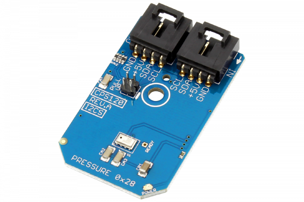

# CPS120

The CPS120 is a high-quality, low-cost capacitive absolute pressure sensor solution with a compensated digital pressure and temperature output for low pressure applications, such as barometric sensing.
This Device is available from www.ncd.io 

[SKU: CPS120_I2CS]

(https://store.ncd.io/product/cps120-digital-barometer-altimeter-i2c-mini-module/)
This Sample code can be used with Arduino.

Hardware needed to interface CPS120 sensor with Arduino

1. <a href="https://store.ncd.io/product/i2c-shield-for-arduino-nano/">Arduino Nano</a>

2. <a href="https://store.ncd.io/product/i2c-shield-for-arduino-micro-with-i2c-expansion-port/">Arduino Micro</a>

3. <a href="https://store.ncd.io/product/i2c-shield-for-arduino-uno/">Arduino uno</a>

4. <a href="https://store.ncd.io/product/dual-i2c-shield-for-arduino-due-with-modular-communications-interface/">Arduino Due</a>

5. <a href="https://store.ncd.io/product/cps120-digital-barometer-altimeter-i2c-mini-module/">CPS120 barometer Sensor</a>

6. <a href="https://store.ncd.io/product/i%C2%B2c-cable/">I2C Cable</a>

CPS120:

The CPS120 is a high-quality, low-cost capacitive absolute pressure sensor solution with a compensated digital pressure and temperature output for low pressure applications, such as barometric sensing.

Applications:

•Barometry sensing and temperature measurement.

How to Use the CPS120 Arduino Library

The CPS120 is very easy to interface with arduino.

1.Address calling:The following command is used to call the address of CPS120 to start the transmission.

           cps.getAddr_CPS120(CPS120_DEFAULT_ADDRESS);   // 0x28
           
2.Pressure measurement:The following command is used to measure the pressure.           
           
           cps.Measure_Pressure();
           
3.Temperature measurement:The following command is used to measure the temperature.
           
           cps.Measure_Temperature();
